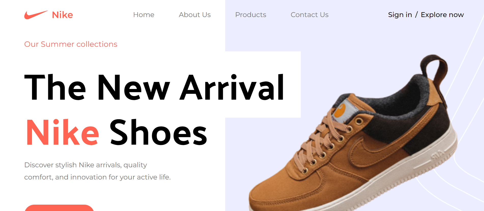
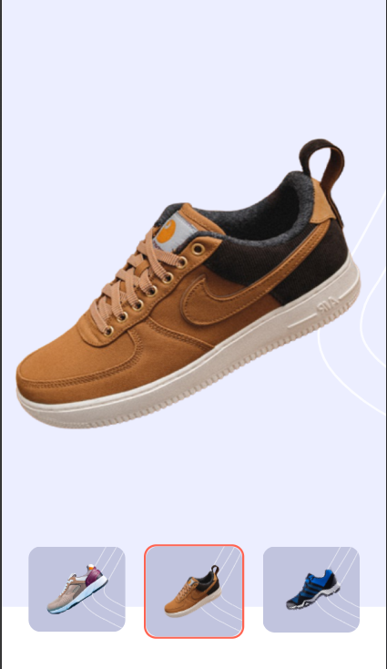
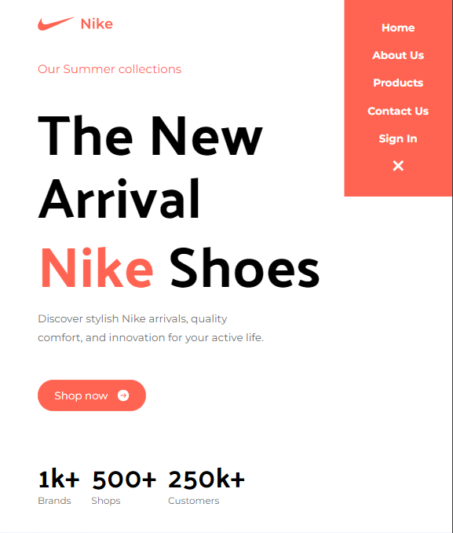
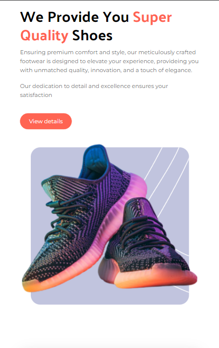
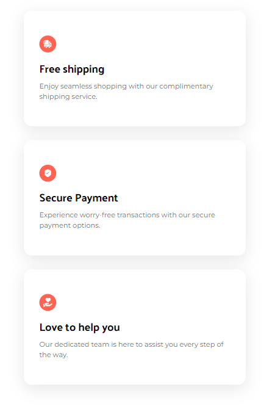
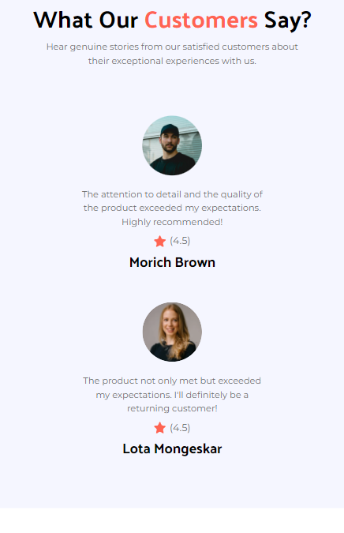

# Nike Landing Page 

This project is a responsive landing page for Nike, built using React and Tailwind CSS. The landing page showcases the latest products, provides information about Nike, and includes interactive elements for a seamless user experience.

## Deployment

Visit the live deployment at [Github Pages](https://anirudhkille.github.io/nike-landing-page/).

## Features

- **Responsive Design:** The landing page is designed to be accessible and functional across various devices and screen sizes.

- **Product Showcase:** Highlight the latest Nike products with visually appealing images and descriptions.

- **Interactive Elements:** Incorporate interactive elements such as buttons, sliders, and hover effects to enhance user engagement.

## Tech Stack

**Client:** React, TailwindCSS

## Screenshots

    
    &ensp; &ensp;

    
    &ensp; &ensp;

    
    &ensp; &ensp;

    
    &ensp; &ensp;

    
    &ensp; &ensp;

    
    &ensp; &ensp;

    
    &ensp; &ensp;

    
    &ensp; &ensp;

    
    &ensp; &ensp;
